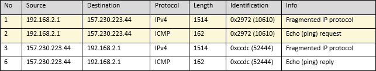
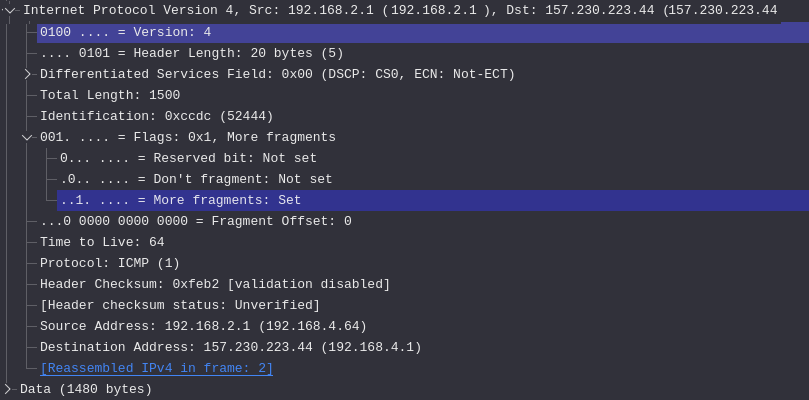
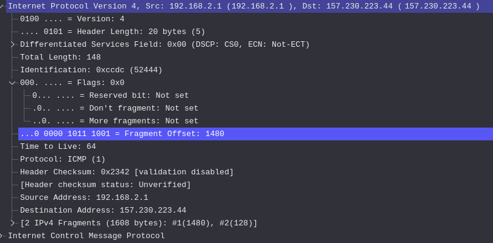

# Fragmented packets    
The maximum size of an ethernet frame is 1518 bytes (18 byte header, plus 1500 byte payload), and if a packet exceeds this value then it has to be split (known as fragmented).   

The best way to show this is using `ping` to send large packets:

```
ping 157.230.223.44 -s 1600
PING 157.230.223.44 (157.230.223.44) 1600(1628) bytes of data.
1608 bytes from 157.230.223.44: icmp_seq=1 ttl=64 time=3.19 ms
1608 bytes from 157.230.223.44: icmp_seq=2 ttl=64 time=41.2 ms
1608 bytes from 157.230.223.44: icmp_seq=3 ttl=64 time=3.10 ms
1608 bytes from 157.230.223.44: icmp_seq=4 ttl=64 time=3.46 ms
```

The packets captured in Wireshark will show that these packets have been fragmented. Notice that for the identification is duplicated (`10610` from the client and `52444` from the server).



For the first fragmented packet, the IP header will have the `More fragments` bit set to 1. 



For subsequent packets, the `Fragment offset` bit will be used to determine where in the receive buffer to place the data. If there are more fragmented packets to follow, the `More fragments` bit will again be set.




In the example above, the client attempted to send a packet of 1600 bytes which is larger than the 1500 bytes allowed. The packet was subsequently split into two:

- The first packet received was 1480 bytes
- The second packet received had a fragment offset of 1480, with the remaining data
- The remaining data was added to the receive buffer at position 1480.
