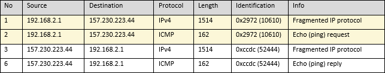

# IP v4 

## Header


## Version
This is the first header field in an IP packet, it is a 4-bit field and always equal to 4 for an IPv4 header.

## IHL
This 4 bit field indicates the size of the IPv4 header, and represents the number of 32-bit words in the header.   

The minimum value in this field is 5:   
- 5 * 32 bits (160 bits / 20 bytes).   
The maximum value in this field is 15:   
- 15 * 32 bits (480 bits / 70 bytes).

## Differential Services
An 8 bit field  describing the type of service for the packet (i.e reliability, precedence, throughput, and delay). 

## Total length
This 16-bit field defines the entire packet size in bytes, including header and data. The minimum size is 20 bytes (header without data) and the maximum is 65,535 bytes.

## Identification


**Linear increments**   
Under most circumstances, this value increments by 1 for each packet sent (note: some operating systems will randomise this).  

In the capture above, the client `192.168.2.1` begins the handshake with an identification of `10610`. The server then acknowledges this handshake and sends it's identification back which is `32375`, the client then continues incrementing it's identification: `10611`, `10612` and `10613`. The server also increments it's identification: `32376` and `32377`.   

This implies that the operating system does not use random identification values, and that both the client and server are not busy communicating with other devices.   

**Large increments**   
If the server starts sending identification values that increment by large amounts (not random values), then this implies that the server is communicating with multiple clients as seen in the following table.


**No increment**   


When the ID remains the same, this indicates that the packet is too large to send in a single frame, and therefore the packet has been fragmented. When a packet is fragmented, the [Flags](#flags) has the `more fragments` bit set. For the operating system to be able to re-assemble the fragmented packets, it uses the ID to determine which other frames contain the remaining packets. See [Fragmented Packets](fragmented_packets.md#fragmented-packets)

**Zero ID**   
Sometimes the ID will be zero (0x0000) which indicates that the server does not want to be fingerprinted.

## Flags
This 3-bit field is used to control or identify fragments:   

- bit 0: Reserved; must be zero.
- bit 1: Don't Fragment
- bit 2: More Fragments

## Fragment offset
This field specific the offset of the current fragment, and is relative to the beginning of the original IP datagram.

## Time To Live
Time To Live (TTL) is a period of time that a packet should exist before it is discarded, it's value is decremented by 1 each time it crosses a network (also known as a hop)

The starting TTL is usually one of:
- 64
- 128
- 255

If you examine the output of ping, you can calculate how many hops (network, bridge, switch etc) that the packet traveled before it reached its destination.

```
PING www.google.com (216.239.38.120) 56(84) bytes of data.
64 bytes from 216.239.38.120: icmp_seq=1 ttl=118 time=10.1 ms
64 bytes from 216.239.38.120: icmp_seq=2 ttl=118 time=12.5 ms
64 bytes from 216.239.38.120: icmp_seq=3 ttl=118 time=12.5 ms
64 bytes from 216.239.38.120: icmp_seq=4 ttl=118 time=12.5 ms
```

Here, the `ttl` is reported as `118` which means that there are `10` hops between the client and the server (assuming that the server's TTL begins at `128`). The round trip latency is about `12ms`

To find what the starting TTL of your operating system is, ping `127.0.0.1`:

```
PING 127.0.0.1 (127.0.0.1) 56(84) bytes of data.
64 bytes from 127.0.0.1: icmp_seq=1 ttl=64 time=0.012 ms
64 bytes from 127.0.0.1: icmp_seq=2 ttl=64 time=0.055 ms
64 bytes from 127.0.0.1: icmp_seq=3 ttl=64 time=0.063 ms
64 bytes from 127.0.0.1: icmp_seq=4 ttl=64 time=0.052 ms
```

Here, the `ttl` is reported as `64` because 127.0.0.1 is the local loopback adapter and the packets did not travel across any network.


## Protocol
This field defines the protocol used in the data portion of the IP datagram.

## Header checksum
This 16-bit header is a checksum field, and is used for error checking of the header. When the packet arrives at a hop (switch, router, server), the checksum of the header is calculated and compared with this field. If the values to not match, the packet is discarded.

## Source address
This 32-bit field is the IPv4 address of the sender of the packet. It may be changed in transit by network address translation (NAT).

## Destination address
This 32-bit field is the IPv4 address of the receiver of the packet. It may be affected by NAT.

## Options
This field is rarely used, and is only present when the [IHL](#ihl) field is greater than 5. The possible options that can be used are as follows:  

| Field  | Size (bits) | Description  |
|--------|-------------|------------------------------------------------------------------------------|
| Copied | 1           | Set to 1 if the options need to be copied to fragmented packets              |
| Class  | 2           | 0 for control options, 2 for debugging, 1 and 3 are reserved                 |
| Option | 5          | Specifies an option                                                          |
| Length | 8           |  Indicates the entire size of an option, including this field. May be omitted |
| Data   | Variable    | Option specific data, this field may be omitted                              |

**Option types**   
| Type      | Name | Description |
|-----------|------|-------------|
| 0 / 0x00  | EOOL   | End Of Options List           |
| 1/0x01    | NOP    | No Operation                  |
| 2/0x02    | SEC    | Security (defunct)            |
| 7/0x07    | RR     | Record Route                  |
| 10/0x0A   | ZSU    | Experimental Measurement      |
| 11/0x0B   | MTUP   | MTU Probe                     |
| 12/0x0C   | MTUR   | MTU Reply                     |
| 15/0x0F   | ENCODE | ENCODE                        |
| 25/0x19   | QS     | Quick-Start                   |
| 30/0x1E   | EXP    | RFC3692-style Experiment      |
| 68/0x44   | TS     | Time Stamp                    |
| 82/0x52   | TR     | Traceroute                    |
| 94/0x5E   | EXP    | RFC3692-style Experiment      |
| 130/0x82  | SEC    | Security (RIPSO)              |
| 131/0x83  | LSR    | Loose Source Route            |
| 133/0x85  | E-SEC  | Extended Security (RIPSO)     |
| 134/0x86  | CIPSO  | Commercial IP Security Option |
| 136/0x88  | SID    | Stream ID                     |
| 137/0x89  | SSR    | Strict Source Route           |
| 142/0x8E  | VISA   | Experimental Access Control   |
| 144/0x90  | IMITD  | IMI Traffic Descriptor        |
| 145/0x91  | EIP    | Extended Internet Protocol    |
| 147/0x93  | ADDEXT | Address Extension             |
| 148/0x94  | RTRALT | Router Alert                  |
| 149/0x95  | SDB    | Selective Directed Broadcast  |
| 151/0x97  | DPS    | Dynamic Packet State          |
| 152/0x98  | UMP    | Upstream Multicast Packet     |
| 158/0x9E  | EXP    | RFC3692-style Experiment      |
| 205/0xCD  | FINN   | Experimental Flow Control     |
| 222/0xDE  | EXP    | RFC3692-style Experiment      |

**Example**
The Record Route option is present when pinging an address with the `-R` option set.

```
ping -R 192.168.0.1
PING 192.168.0.1 (192.168.0.1) 56(124) bytes of data.
64 bytes from 192.168.0.1: icmp_seq=1 ttl=64 time=5.79 ms
RR: 	192.168.0.3
	192.168.0.1
	192.168.0.1
	192.168.0.3

64 bytes from 192.168.0.1: icmp_seq=2 ttl=64 time=3.87 ms	(same route)
64 bytes from 192.168.0.1: icmp_seq=3 ttl=64 time=7.67 ms	(same route)
64 bytes from 192.168.0.1: icmp_seq=4 ttl=64 time=5.86 ms	(same route)
```

The resulting packets are seen in wireshark:


