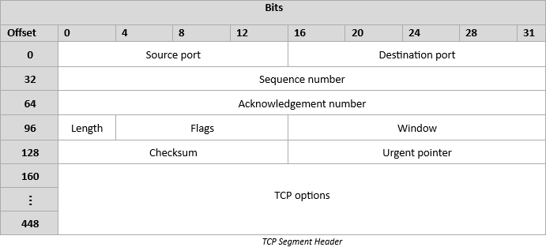

# TCP Segment Header

## Source port
This 16-bit field defines the sending port (1 - 65535)

## Destination port
This 16-bit field defines the receiving port (1 - 65535)

## Sequence number
This 32-bit field has two modes of operation

- **3-way handshake**  
  If the SYN flag is set, then this is the initial sequence number (for both the client and the server).
- **Data transmission**   
    If the SYN flag is unset, then this is the accumulated sequence number of the first data byte of this segment for the current session.

## Acknowledgement number
This 32-bit field is the next sequence number that the sender of the ACK is expecting.

## Length
This 4-bit field is the size of the TCP header in 32-bit words. The minimum size if 5 words (20 bytes), and the maximum size is 15 words (60 bytes).

## Flags
This 8-bit field contains the following control bits:   

| Bit | Name | Value |
|-----|------|-------|
| 1   | CWR  | Congestion Window Reduced is a flag set by the sending host to indicate that it received a TCP segment with the ECE flag set. |
| 2   | ECE  | ECN-Echo indicates that the TCP peer is ENC capable when the SYN flag is unset. If the SYN flag is not set, then this represents network congestion. |
| 3   | URG  | Indicates that the Urgent pointer field has been set. |
| 4   | ACK  | Indicates the the Acknowledgement field has been set. |
| 5   | PSH  | Push function. Asks to push the buffered data to the receiving application. |
| 6   | RST  | Reset the connection. |
| 7   | SYN  | Synchronize sequence numbers | This is used for the 3-way handshake |
| 8   | FIN  | Last packet sent from the sender |

## window
This 16-bit field indicates the number of window size units that the sender of this segment is willing to receive.

window size units = > 2^window scale

## checksum
This 16-bit header is a checksum field, and is used for error checking of the header. When the packet arrives at a hop (switch, router, server), the checksum of the header is calculated and compared with this field. If the values to not match, the packet is discarded.

## Urgent pointer
This 16-bit field is an  offset from the sequence number indicating the last urgent data byte.

## TCP Options
The length of this field is determined by the value of [Length](#length), if Length is greater than 5 then this field contains TCP Options. 

Options have up to 3 fields:   

| Option | Size     | Description                     |
|--------|----------|---------------------------------|
| Kind   | 1        | Indicates the option            |
| Length | 1        | Indicates the data length       |
| Data   | Variable | Data associated with the option |

The most common options are:

- **Maximum Segment Size (MSS)**   
  This is the largest amount of data in bytes that TCP is willing to receive in a single segment.  
- **Window Scaling**   
  The 16-bit TCP [Window](#window) size is limited to 65,535 bytes which is limited in today's usage of the internet. So this TCP option was added to allow this value to be increased. This option is defined in the 3-way handshake, and is used to determine the window size unit.
- **Selective Acknowledgements (SACK)**   
  SACK helps the sender identify gaps in the receive bugger. When the recipient does not receive packets in order, then there are lost segments. This option allows the identification of missing segments early.
- **Timestamps**   
  This helps determine in which order packets were sent.
- **Nop**   
  This option helps separate the different options used within the TCP Option field.
  

This field can be padded with 0x00 if necessary.

